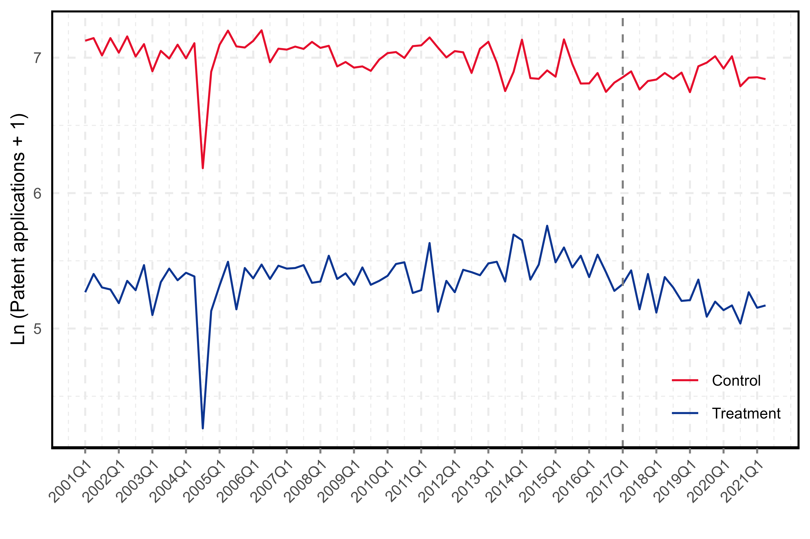

# Este es el titulo 

Este es el texto de mi archivo de markdown. 

- Para hacer una lista, uso el guion
- *cursivas*
- **negrillas**
- _cursiva_ (guion bajo)

## Ejemplo de Tabla

| Columna 1 | Columna 2 | Columna 3 |
|-----------|-----------|-----------|
| Dato 1    | Dato 2    | Dato 3    |
| Dato 4    | Dato 5    | Dato 6    |
| Dato 7    | Dato 8    | Dato 9    |

| dddd | dddd | dddd |
|----- |----- |----- |

## Tabla de regresion


|                                  |      (1)      |
|----------------------------------|:-------------:|
| VARIABLES                        | turnout_total |
|                                  |               |
| treatment                        |    8.301**    |
|                                  |    (3.487)    |
| registered_total                 |   0.0582***   |
|                                  |   (0.00382)   |
| Constant                         |    337.2***   |
|                                  |    (9.714)    |
|                                  |               |
| Observations                     |     6,950     |
| R-squared                        |     0.111     |
| Standard   errors in parentheses |               |
| ***   p<0.01, ** p<0.05, * p<0.1 |               |

## Ejemplo de documentacion de codigo

A continuacion se describe un algoritmo de regresion lineal en R mediante la libreria `fixest`.

```r
feols(y ~ x + z, data = df)
```

El equivalente en Python es:

```python
a = b + 1
```

```bash
git clone 
```

# Importando imagenes 




# Utilizando LaTeX en Md

$$ Y = \beta_0 + \beta_1x + u_i$$

$$ \frac{\partial Y}{\partial x} $$